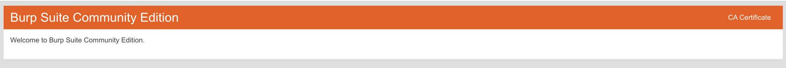

# Burp Suite

## 抓包方式一（Burp suite和内置浏览器）
+ 操作步骤
  + 1 .
  + 2 .open browser之后可以在打开的浏览器中输入网址
  + 3 .观察Burp --> Proxy --> http history 可以看到所有请求
  + 4 .如果需要拦截请求，在intercept中打开开关，被拦截后，可以使用forward放行

## 抓包方式二
+ 操作步骤
  + 浏览器配置代理
    + [不使用插件直接在浏览器中配置代理](https://portswigger.net/burp/documentation/desktop/external-browser-config/browser-config-chrome-macos)
    + 使用插件（FoxyProxy）配置代理
  + 打开浏览器中FoxyProxy Burp代理
    + 
  + chrome中输入http://burpsuite/或http://burp/
    + 
    + 也可下载CA证书，后续安装证书（抓包https）
  + 配合Burp Suite工具，chrome打开url，在关闭拦截的情况下查看Proxy--> Http history，可以看到所有请求
  + 也可以打开Burp Suite的拦截，当chrome 请求到达BP时候，使用forward进行转发放行

